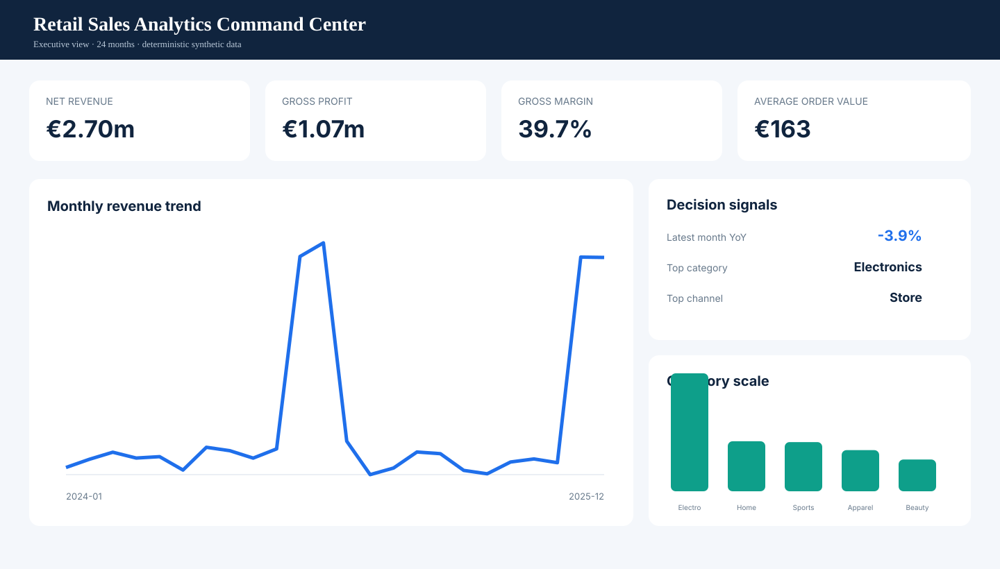
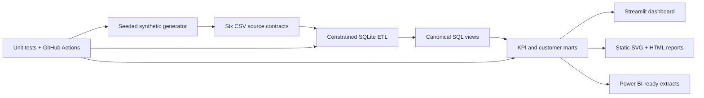
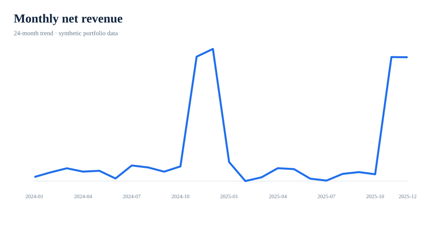
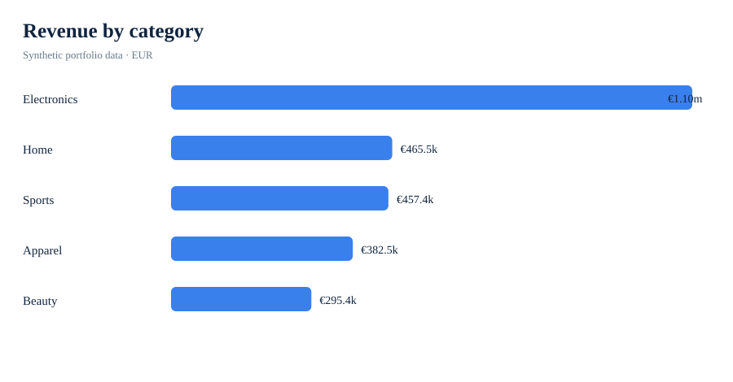
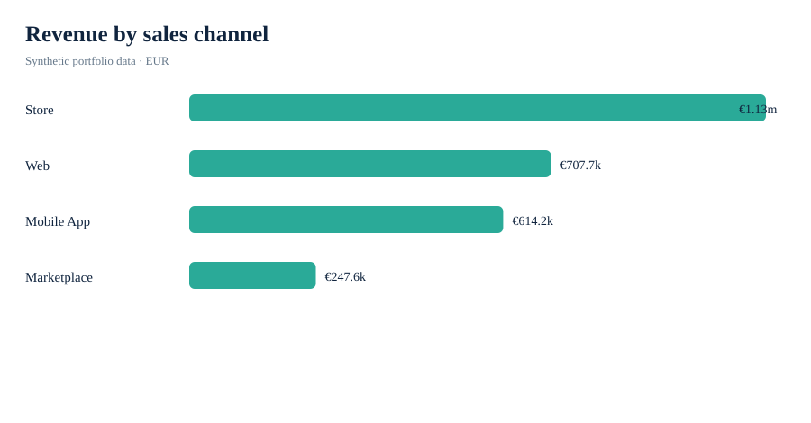
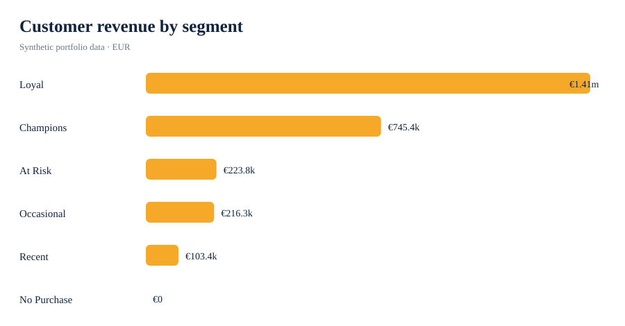

# Retail Sales Analytics Platform

[](https://github.com/Bheemeshd/retail-sales-analytics-platform/actions/workflows/ci.yml)

An end-to-end commercial analytics product that turns multichannel retail transactions into governed revenue, margin, product, store, customer and campaign insights. It demonstrates the work of a retail data analyst across business framing, data generation, SQL modelling, Python orchestration, dashboarding, quality controls and executive storytelling.

> **Portfolio disclosure:** every customer, order, product event and monetary value is synthetic. The metrics demonstrate analytical technique, not the performance of a real retailer.



## Business question

How can a retailer create one trusted performance view that helps commercial leaders decide where to protect margin, invest by channel, improve stores, refine the product mix and test customer or campaign interventions?

## Executive snapshot

The checked-in artifacts were produced with seed **42**, **3,000 customers**, **18,000 orders** and **32,297 order lines** across January 2024–December 2025.

| KPI | Synthetic result |
| --- | ---: |
| Net revenue | €2.70m |
| Gross profit | €1.07m |
| Gross margin | 39.7% |
| Completed orders | 16,560 |
| Average order value | €162.90 |
| Return rate | 5.0% |
| Top category | Electronics (€1.10m) |
| Top channel | Store (€1.13m) |
| Latest-month revenue YoY | −3.9% |

These values are deterministic scenario outputs. They are useful for reviewing the workflow and decision logic, not for external benchmarking.

## Decisions supported

| Consumer | Decision | Product output |
| --- | --- | --- |
| Commercial director | Monitor revenue, profit, margin and channel mix | Executive dashboard and monthly KPI mart |
| Category manager | Balance category/SKU scale against margin | Category and product performance marts |
| Regional manager | Identify store outliers within comparable markets | Store leaderboard with region context |
| CRM analyst | Form customer activation and retention hypotheses | Customer 360 and transparent RFM segments |
| Marketing lead | Identify campaign associations requiring experiments | Spend, attributed revenue and ROAS view |
| Finance/data team | Reconcile reported metrics to governed definitions | SQLite semantic layer, controls and tests |

## End-to-end architecture



## Portfolio visuals

| Revenue trend | Category performance |
| --- | --- |
|  |  |

| Channel mix | Customer value segments |
| --- | --- |
|  |  |

## What is inside

```text
.
├── app/streamlit_app.py          Interactive commercial command center
├── assets/                       Dashboard preview and four SVG charts
├── data/sample/                  Reviewable sample of every source contract
├── data/raw/                     Full reproducible sources generated locally
├── data/processed/               Decision marts and executive KPI JSON
├── docs/                         Brief, architecture, dictionary, method, walkthrough
├── notebooks/                    Databricks/PySpark medallion deployment adapters
├── powerbi/                      Model guide, DAX and versionable extracts
├── reports/                      Executive HTML dashboard and written memo
├── scripts/                      One-command pipeline entry points
├── sql/                          Schema, governed views, analysis and controls
├── src/retail_analytics/         Generator, ETL, analytics, reporting and orchestration
└── tests/                        Determinism, integrity, reconciliation and artifact checks
```

## Reproduce locally

The core pipeline uses only the Python standard library and supports Python 3.9+.

```bash
git clone https://github.com/Bheemeshd/retail-sales-analytics-platform.git
cd retail-sales-analytics-platform
python3 scripts/run_pipeline.py
python3 -m unittest discover -s tests -v
```

Scale or reseed the scenario:

```bash
python3 scripts/run_pipeline.py --seed 7 --customers 1000 --orders 5000
```

Run the interactive dashboard:

```bash
python3 -m venv .venv
source .venv/bin/activate
python -m pip install -r requirements.txt
streamlit run app/streamlit_app.py
```

## Analytical layer

The canonical `v_sales_detail` view defines net revenue and gross profit at order-line grain with customer, product, channel, store and campaign context. Every downstream output reconciles to this semantic layer.

`sql/analysis.sql` includes six recruiter-readable analyses: monthly YoY performance, category economics, channel contribution, within-region store ranking, customer value and campaign attribution.

## Power BI and Databricks

- `powerbi/` provides a star-schema guide, core DAX measures and generated CSV extracts. A proprietary `.pbix` file is intentionally not required to review the work.
- `notebooks/` provides Databricks source notebooks for bronze ingestion, silver transformation and gold KPIs. They are documented deployment adapters; the locally tested SQLite pipeline remains the reproducible reference implementation.

## Quality and governance

The automated checks cover deterministic generation, source/database row-count reconciliation, relational integrity, one-row-per-order-line grain, commercial channel/store rules, revenue reconciliation and visual-artifact validity. GitHub Actions also runs a fresh end-to-end smoke pipeline on every push and pull request.

## Interpretation boundaries

- Campaign-linked revenue is descriptive attribution, not causal lift. Budget decisions require randomized holdouts or another defensible counterfactual.
- Standard cost excludes logistics, overhead and returns-processing cost.
- RFM rules are transparent hypotheses and should be calibrated on real distributions.
- The project intentionally avoids forecasting from synthetic demand history.

## Documentation

- [Business brief](docs/business_brief.md)
- [Architecture](docs/architecture.md)
- [Data dictionary](docs/data_dictionary.md)
- [Methodology and limitations](docs/methodology.md)
- [Five-minute recruiter walkthrough](docs/recruiter_walkthrough.md)
- [Generated executive summary](reports/executive_summary.md)
- [Power BI implementation guide](powerbi/README.md)

## License

MIT License. See [LICENSE](LICENSE).
