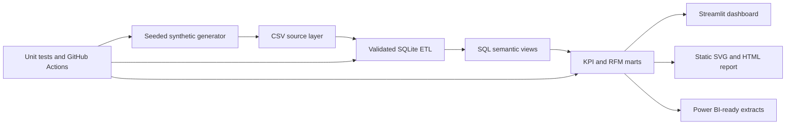

# Architecture

## Design choices

- The generator is deterministic and contains no personal or confidential data.
- CSV files represent the raw contract; SQLite provides constraints, relationships and reusable views.
- `v_sales_detail` is the canonical line-level semantic layer. Every downstream KPI reconciles to it.
- Static artifacts make the results visible directly on GitHub; Streamlit provides interactive exploration.
- Power BI-ready extracts reuse the same marts rather than introducing a second KPI definition.
- Databricks notebooks are optional deployment adapters. The core project runs locally without Spark.
