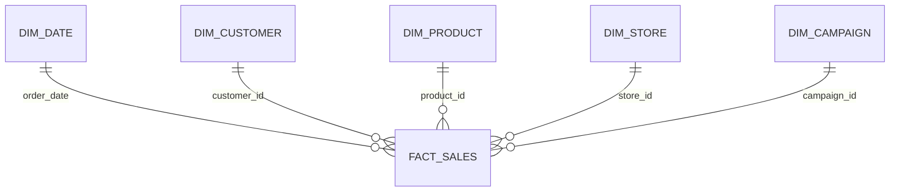

# Power BI semantic model



## Core DAX measures

```DAX
Net Revenue = SUM ( FactSales[net_revenue] )
Gross Profit = SUM ( FactSales[gross_profit] )
Gross Margin % = DIVIDE ( [Gross Profit], [Net Revenue] )
Completed Orders = CALCULATE ( DISTINCTCOUNT ( FactSales[order_id] ), FactSales[status] = "Completed" )
Average Order Value = DIVIDE ( [Net Revenue], [Completed Orders] )
Revenue PY = CALCULATE ( [Net Revenue], SAMEPERIODLASTYEAR ( DimDate[Date] ) )
Revenue YoY % = DIVIDE ( [Net Revenue] - [Revenue PY], [Revenue PY] )
```

Use single-direction one-to-many relationships from dimensions to the fact. Keep campaign measures labeled “attributed” unless an experimental control group is available.
